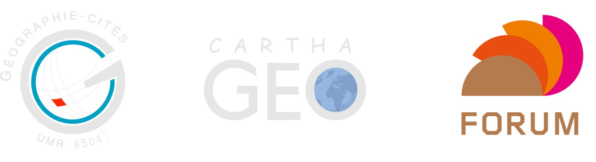

## Présentation du projet

L'automobile est au coeur d'un système d'externalités négatives bien renseigné qui affecte la santé publique via la pollution locale et l'accidentologie, qui nuit à l'environnement local et mondial via sa participation au changement climatique, et qui consomme une part importante de l'espace urbain. L'Ile-de-France, de plus en plus connue pour ses pics de pollution et ses embouteillages à répétition, offre un cas particulièrement intéressant pour penser une sortie de l'automobile. Elle présente à la fois une agglomération dense où l'utilisation de l'automobile diminue et des espaces périphériques (espaces ruraux et villes secondaires), moins pourvus en transports alternatifs, où son usage continue de croître.

Le projet [Postcar Île-de-France](http://fr.forumviesmobiles.org/projet/2017/02/27/post-car-ile-france-3516) est une collaboration de recherche entre le laboratoire [Géographie-Cités](http://parisgeo.cnrs.fr) et le [Forum des Vies Mobiles](http://fr.forumviesmobiles.org). Le laboratoire Géographie-cités a composé une équipe réunissant des compétences pluridisciplinaires d'aménagement-urbanisme ([Jean Debrie](http://www.parisgeo.cnrs.fr/spip.php?article5684&lang=fr), [Juliette Maulat](http://www.parisgeo.cnrs.fr/spip.php?article324&lang=fr), de géographie urbaine ([Sandrine Berroir](http://www.parisgeo.cnrs.fr/spip.php?article51&lang=fr) et de modélisation en géographie ([Arnaud Banos](http://www.parisgeo.cnrs.fr/spip.php?article5&lang=fr), [Hadrien Commenges](http://www.parisgeo.cnrs.fr/spip.php?article87&lang=fr). Les chercheurs sont accompagnés par les étudiants d'un atelier du master Aménagement-Urbanisme (Univ. Paris 1) et du master Carthagéo (Univ. Paris 1, Univ. Paris 7, ENSG). **Cette application est le fruit du travail effectué dans le cadre de l'atelier du master Carthagéo**.

## Citation

- **pour l'application :**
	- COMMENGES Hadrien (dir.), ADOLPHE Mary Francia, AINSA Alice, BASSOLE Simon, BEN RHAIM Mohamed Amine, BOCQUILLON Marie, DESHAYES Marion, DOUET Aurélie, FOUGEIROL Séverine, JANIN Oscar, LAMY Thomas, MARCEL Olivier, MUSSEAU Laurent, PAIRE Marianne, PICARD Floriane, POTTIER Billy, QUENON Maxime, RABINIAUX Coralie, VERDIER Cédric (2017) *Apérit-IF : explorations introductives sur les mobilités en Île-de-France*, UMR 8504 Géographie-cités.

- **pour les données :**
	- fond de carte : OpenStreetMap, Carto.DB, leaflet
	- délimitations administratives : IGN, Base municipale Geofla 2012
	- temps de transport : DRIEA-IF, Matrices de temps de transport du modèle MODUS
	- navettes domicile-travail : Insee, Recensement de la population 2012
	- aspirations : Forum des Vies Mobiles & ObSoCo, Enquête aspirations

## Accès à l'application et au code

- Accès à l'application Apérit-IF sur le serveur de l'UMR 8504 Géographie-cités : XXX
- Accès à l'application Apérit-IF sur le serveur du TGIR Huma-Num : https://analytics.huma-num.fr/Hadrien.Commenges/aperitif
- Accès au code de l'application sur le dépot Github : https://github.com/Geographie-cites/aperitif

## Bibliographie

- Sur le calcul de l'indice de mobilité potentielle (onglet **Vitesses**), voir Martens K. (2015) "Accessibility and potential mobility as a guide for policy action", *Transportation Research Record*, nº2499, pp.18-24.
- Sur le calcul de l'accessibilité gravitaire (onglet **Bassins**), voir Commenges H., Giraud T., Lambert N. (2016) "ESPON FIT : Functional indicators for spatial-aware policy-making", *Cartographica*, vol.51, nº3, pp.127-136.
- Pour une application des méthodes d'accessibilité gravitaire sur la France, voir le rapport de l'Observatoire des Territoires intitulé [Emploi et territoires](http://www.cget.gouv.fr/ressources/publications/emploi-et-territoires-rapport-de-l-observatoire-des-territoires-2016).
- Sur les outils utilisés : le langage **R**, les packages **sp**, **SpatialPosition**, **shiny** et **leaflet**.
